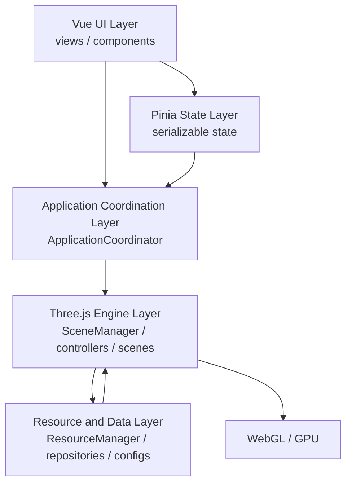

# 银河系科普探索站 - AI 协同开发架构规范 v1.0

## 1. 文档说明

本文档用于约束银河系科普探索站后续 AI 协同开发中的架构、模块边界、资源生命周期、性能和验证规则。适用范围包括 Vue 3 前端、Pinia 状态、Three.js/WebGL 引擎、天文数据配置、GLB 模型加载、交互控制和文档协作。

目标读者包括前端开发者、Three.js 开发者、代码审查者和执行本项目任务的 AI 编码代理。若本文档与具体任务说明冲突，优先级为：用户任务说明、`AGENTS.md`、本文档、ADR、普通 README。架构变更必须新增或更新 ADR，并在任务最终报告中说明影响范围。

版本信息：

- 版本：v1.0。
- 阶段：Phase 0。
- 状态：已采用。
- 变更流程：先提出架构问题，再更新 ADR，最后同步修改 `AGENTS.md` 或本文档。

## 2. 项目开发原则

1. 分层架构原则：依赖必须从 UI 向引擎和数据层单向流动，禁止 Three.js 模块反向依赖 Vue 页面。
2. 单一职责原则：每个模块只拥有一个清晰职责，场景、渲染、资源、相机、交互和数据访问必须分离。
3. 配置驱动原则：天体参数、模型路径、比例、轨道、相机锚点和画质等级应当由配置驱动。
4. 生命周期统一原则：长期运行模块必须实现统一生命周期，便于场景切换和销毁。
5. 单一动画循环原则：全应用只能有一个主 RAF 循环，避免重复渲染、时间漂移和泄漏。
6. 资源显式释放原则：创建 WebGL 资源的模块必须明确释放责任。
7. 性能优先原则：银河粒子、轨道、Bloom、Shader 和模型面数必须以浏览器稳定性为约束。
8. 渐进式实施原则：先完成太阳系 MVP，再扩展银河系；禁止提前实现未验收的复杂能力。
9. 可测试原则：纯数据、状态转换、配置校验、模块生命周期和事件流必须可单独测试。
10. 最小范围修改原则：每个任务只修改允许范围内文件，禁止混入无关重构和格式化。

## 3. 系统总体架构



### 3.1 Vue UI Layer

- 职责：页面布局、控件、信息面板、用户输入入口。
- 输入：用户点击、路由参数、Store 状态。
- 输出：Store action、`ApplicationCoordinator` 命令。
- 可依赖：Pinia Store、Repository 的只读查询接口、类型定义。
- 禁止依赖：`THREE.*` 运行时对象、场景内部模块、WebGL renderer。
- 通信方式：Props、Emits、Store action、协调器命令。

### 3.2 Pinia State Layer

- 职责：保存可序列化业务状态和 UI 状态。
- 输入：UI action、Three.js 事件转换后的领域事件。
- 输出：状态快照、派生 getter、命令所需参数。
- 可依赖：类型定义、纯数据工具。
- 禁止依赖：Three.js 类实例、DOM 节点、Controls、Tween。
- 通信方式：Store action 和订阅。

### 3.3 Application Coordination Layer

- 职责：连接 UI 状态、命令和 Three.js 引擎，处理场景切换、相机命令和选择同步。
- 输入：Store action、页面生命周期、用户命令。
- 输出：调用 `SceneManager`、更新 Store、记录错误。
- 可依赖：Store、`SceneManager`、Repository、类型定义。
- 禁止依赖：Vue 组件实例。
- 通信方式：类型化命令和事件回调。

### 3.4 Three.js Engine Layer

- 职责：Scene、Camera、Renderer、Controls、Object3D、动画、拾取、后处理。
- 输入：协调器命令、时间步长、Pointer 事件、Resize 事件。
- 输出：领域事件、渲染结果、资源释放结果。
- 可依赖：Three.js、资源层、配置、类型定义。
- 禁止依赖：Vue 组件、Pinia 实例、路由。
- 通信方式：类型化回调，不直接写 UI。

### 3.5 Resource and Data Layer

- 职责：模型、纹理、配置、天文数据和科普数据的加载、缓存、查询和释放。
- 输入：资源 key、场景类型、画质等级、语言代码。
- 输出：只读配置、已加载资源、加载错误。
- 可依赖：Three.js Loader、Fetch、静态配置。
- 禁止依赖：Vue 组件、场景 UI 状态。
- 通信方式：Repository 查询和 Loader Promise。

### 3.6 WebGL / GPU

- 职责：浏览器底层渲染能力。
- 输入：Renderer 提交的绘制命令。
- 输出：Canvas 图像。
- 可依赖：浏览器能力。
- 禁止依赖：业务状态。
- 通信方式：由 Three.js 封装访问。

## 4. 推荐工程目录

```text
src/
├── app/
├── views/
├── components/
├── stores/
├── three/
│   ├── core/
│   ├── scenes/
│   ├── solar/
│   ├── galaxy/
│   ├── controllers/
│   ├── loaders/
│   ├── effects/
│   └── utils/
├── data/
├── repositories/
├── types/
├── utils/
├── assets/
└── styles/
```

| 目录 | 职责 | 可存放内容 | 不应存放内容 | 依赖关系 |
| --- | --- | --- | --- | --- |
| `src/app/` | 应用装配 | `ApplicationCoordinator`、启动编排 | 具体场景实现 | 可依赖 stores、three、repositories |
| `src/views/` | 路由页面 | 页面级 Vue SFC | Three.js 对象创建逻辑 | 可依赖 components、stores、app |
| `src/components/` | 展示组件 | 面板、按钮、HUD | 场景管理器和 renderer | 可依赖 stores、types |
| `src/stores/` | 状态管理 | Pinia stores、可序列化状态 | Three.js 实例 | 可依赖 types、utils |
| `src/three/core/` | 引擎核心 | Renderer、Animation、SceneManager、BaseScene | Vue 组件 | 可依赖 controllers、loaders、effects、utils |
| `src/three/scenes/` | 通用场景 | 场景基类组合、场景注册 | UI 面板 | 可依赖 core、controllers |
| `src/three/solar/` | 太阳系场景 | 行星、轨道、月球、太阳逻辑 | 银河粒子专属实现 | 可依赖 core、controllers、data |
| `src/three/galaxy/` | 银河系场景 | `BufferGeometry + Points` 粒子、星云 | 大量独立 Mesh 恒星 | 可依赖 core、effects、data |
| `src/three/controllers/` | 控制器 | `CameraController`、`InteractionManager` | Store 实例 | 可依赖 Three.js、types |
| `src/three/loaders/` | 加载器 | `ModelLoader`、纹理加载包装 | 业务 UI 逻辑 | 可依赖 Three.js Loader |
| `src/three/effects/` | 后处理 | Bloom、Composer、Shader pass | 场景业务数据 | 可依赖 Three.js examples |
| `src/three/utils/` | Three 工具 | dispose、math、object traversal | UI 工具 | 可依赖 Three.js |
| `src/data/` | 静态数据 | 行星配置、科普文本、默认参数 | 运行时对象 | 可依赖 types |
| `src/repositories/` | 数据访问 | `PlanetRepository` | renderer、controls | 可依赖 data、types |
| `src/types/` | 类型定义 | 公共接口、命令、事件 | 具体实现 | 不依赖业务实现 |
| `src/utils/` | 通用工具 | 字符串、数值、错误格式化 | Three.js 专用释放逻辑 | 可依赖 types |
| `src/assets/` | 静态资源 | 图片、模型、纹理 | 源代码 | 被配置和 loader 引用 |
| `src/styles/` | 全局样式 | 变量、基础布局 | 三维逻辑 | 被 Vue 层引用 |

## 5. 核心模块职责

| 模块 | 单一职责 | 输入 | 输出 | 允许依赖 | 禁止依赖 | 生命周期 | 错误处理 | 测试重点 |
| --- | --- | --- | --- | --- | --- | --- | --- | --- |
| `ApplicationCoordinator` | 编排 UI 命令和引擎命令 | Store 状态、页面事件 | 引擎调用、Store 更新 | stores、SceneManager、repositories | Vue 组件实例 | init/destroy | 捕获命令失败并写入可序列化错误 | 命令到引擎调用映射 |
| `SceneManager` | 管理当前场景和切换 | 场景 key、容器、时间步 | 当前场景渲染与事件 | BaseScene、RendererManager | Vue、Pinia | init/start/update/pause/resume/resize/destroy | 切换失败回滚或降级 | 切换顺序和销毁 |
| `BaseScene` | 定义场景契约 | renderer、camera、资源接口 | Scene 对象和事件 | Three.js、ResourceManager | UI 层 | 标准生命周期 | 初始化失败时释放已创建资源 | 生命周期幂等 |
| `RendererManager` | 创建和持有 renderer | canvas、画质等级 | renderer、resize API | Three.js | 具体场景业务 | init/resize/destroy | WebGL 不支持或 context lost | pixelRatio 上限 |
| `AnimationManager` | 拥有唯一 RAF | update 回调 | deltaTime 驱动更新 | Clock、SceneManager | 场景业务配置 | start/pause/resume/destroy | RAF 取消失败保护 | deltaTime clamp |
| `ResourceManager` | 资源缓存和所有权 | resource key | 资源句柄 | loaders、dispose utils | Vue、Store | init/destroy | 加载失败分类 | 引用计数与重复释放 |
| `ModelLoader` | 加载和预处理 GLB | 模型路径、预处理选项 | GLTF 或 clone | GLTFLoader | UI、Store | load/dispose cache | 路径错误和格式错误 | 失败传播 |
| `SolarScene` | 太阳系场景组合 | 行星配置、资源 | 太阳系三维展示 | BaseScene、PlanetManager | Vue 组件 | 标准生命周期 | 单个模型失败降级 | MVP 场景稳定 |
| `GalaxyScene` | 银河系场景组合 | 粒子配置、资源 | 银河系三维展示 | BaseScene、EffectManager | 大量 Mesh 恒星 | 标准生命周期 | 粒子资源失败降级 | Points 性能 |
| `PlanetManager` | 管理天体节点 | `PlanetConfig[]` | Object3D 层级、查询 API | Three.js、ResourceManager | Store | init/update/destroy | 单天体资源失败隔离 | 公转/自转节点 |
| `OrbitManager` | 管理轨道显示 | 轨道配置、可见性 | 轨道对象 | Three.js | UI 组件 | init/update/destroy | 配置错误跳过轨道 | 轨道开关 |
| `InteractionManager` | 统一拾取和高亮 | pointer、raycaster targets | 天体选择事件 | Three.js、CameraController | Pinia | init/update/destroy | 无目标时安全退出 | 注册/注销对象 |
| `CameraController` | 统一相机控制 | 命令、目标锚点 | 相机姿态 | Three.js、Tween | Vue 组件 | init/update/resize/destroy | 目标缺失时回退 | 跟随、聚焦、复位 |
| `EffectManager` | 后处理和 Shader 参数 | renderer、画质等级、时间 | composer render | Three.js postprocessing | Store | init/update/resize/destroy | composer 创建失败降级 | Bloom 成本 |
| `PlanetRepository` | 提供天体数据 | 天体 ID、语言 | 科普和配置数据 | data、types | Three.js | 无长期资源 | 缺失数据返回友好 fallback | 数据完整性 |

接口签名示意：

```ts
export interface LifecycleModule {
  init(): Promise<void> | void;
  start?(): void;
  update(deltaTime: number): void;
  pause?(): void;
  resume?(): void;
  resize(width: number, height: number): void;
  destroy(): void;
}

export interface SceneEvent {
  type: 'body-selected' | 'scene-ready' | 'scene-error';
  payload: Record<string, unknown>;
}
```

## 6. Vue 开发规范

- 页面组件负责路由级布局和应用级协调，不承载三维细节。
- 展示组件只接收 Props、触发 Emits 或读取 Store，不直接调用 Three.js。
- Props 必须定义明确类型；Emits 必须定义事件名和载荷类型。
- Composable 用于 UI 状态复用、浏览器事件封装和协调器绑定，不持有 renderer。
- Store action 表示业务意图，不暴露 Three.js 实例。
- 组件卸载时必须清理 DOM 事件、订阅、计时器和协调器绑定。
- Three.js Canvas 宿主组件只负责提供 canvas/container 与生命周期入口。
- UI 点击和三维 Pointer 事件必须隔离，HUD 不应穿透触发拾取，除非明确设计。
- 信息面板不得持有 Three.js 对象，只能使用天体 ID 查询 Repository。
- 样式应当支持响应式布局，三维画布与信息面板不得在小屏互相遮挡。

## 7. Three.js 开发规范

- Scene 创建必须由场景模块负责，并在 `destroy` 中清理自身创建的对象。
- Camera 由 `CameraController` 统一管理，其他模块只能提交相机命令或目标锚点。
- Renderer 由 `RendererManager` 创建和持有，禁止场景私自创建第二个 renderer。
- Controls 由控制器创建、更新和释放。
- 主动画循环由 `AnimationManager` 持有，场景只实现 `update(deltaTime)`。
- `deltaTime` 必须以秒为单位，并设置上限，例如 `Math.min(rawDelta, 0.05)`。
- Object3D 层级应当区分公转节点、自转节点、视觉模型节点和交互代理节点。
- 行星公转应当通过轨道父节点角度更新实现。
- 行星自转应当通过模型或自转节点旋转实现。
- 相机跟随必须使用稳定锚点，不直接绑定临时对象。
- Raycaster 只检测显式注册对象，场景销毁时必须注销。
- 模型加载后应当预处理尺寸、中心、材质和阴影策略。
- Shader 时间参数必须由统一时间源驱动。
- EffectComposer 必须随 renderer resize，并在销毁时释放 render target。
- Resize 必须统一入口处理，不允许多个模块重复监听窗口尺寸。
- 页面不可见时必须暂停 RAF 或降低更新频率。
- WebGL Context Lost 必须阻止默认行为并进入可恢复错误状态。
- Destroy 必须清理事件、资源、Tween、Mixer、Controls、Observer 和回调。

## 8. 资源生命周期规范

资源所有权分为：

- 全局共享资源：由 `ResourceManager` 创建、缓存和释放。
- 太阳系场景资源：由 `SolarScene` 或其子管理器创建，场景销毁时释放。
- 银河系场景资源：由 `GalaxyScene` 或其子管理器创建，场景销毁时释放。
- 临时交互资源：由创建它的控制器持有，交互结束或模块销毁时释放。
- 缓存资源：由 `ResourceManager` 通过引用计数或显式缓存策略释放。

创建者必须声明持有者。持有者负责释放。消费者只能释放自己创建的 wrapper 或 clone，不得释放共享原始资源。场景切换时，`SceneManager` 必须先暂停当前场景，再销毁场景私有资源，再加载新场景。页面卸载时，必须销毁当前场景、停止 RAF、释放 renderer、清理事件。

内存泄漏验证应当包括：多次场景切换、Chrome Performance/Memory 观察、renderer.info 采样、事件监听数量检查和 WebGL context lost 恢复验证。

## 9. 状态管理规范

建议 Universe Store 结构：

```ts
export interface UniverseState {
  currentScene: 'solar' | 'galaxy';
  selectedBodyId: string | null;
  cameraMode: 'free' | 'focus' | 'follow';
  panelVisible: boolean;
  loading: { active: boolean; message?: string };
  timeScale: number;
  orbitVisible: boolean;
  quality: 'low' | 'medium' | 'high';
  error: { code: string; message: string; recoverable: boolean } | null;
}
```

Store 保存可序列化状态，不保存 Three.js 对象。Three.js 到 Store 的事件流必须先转换为领域事件，例如 `body-selected`。Store 到 Three.js 的命令流必须通过 `ApplicationCoordinator`，例如 `focusBody(bodyId)`、`switchScene(sceneName)`。天体选择、场景切换和相机状态必须以 Store 为 UI 真相源，以 Three.js 为渲染执行端。异步竞态必须使用请求序号、取消令牌或当前场景校验避免旧请求覆盖新状态。

## 10. 数据与配置规范

`PlanetConfig` 应当区分真实数据与视觉参数：

```ts
export interface PlanetConfig {
  id: string;
  name: string;
  real: {
    radiusKm: number;
    orbitRadiusKm: number;
    rotationPeriodHours: number;
    revolutionPeriodDays: number;
  };
  visual: {
    radiusScale: number;
    orbitRadiusScale: number;
    modelPath?: string;
    texturePath?: string;
    cameraDistance: number;
  };
  orbit: {
    inclinationDeg: number;
    eccentricity: number;
  };
  science: {
    summary: string;
    source: string;
    updatedAt: string;
    locale: 'zh-CN';
  };
}
```

真实天文数据不得被视觉比例覆盖。模型修正参数、轨道参数、自转参数、相机参数和科普数据必须集中配置。Repository 必须提供查询和 fallback，预留多语言字段，数据来源和更新时间必须可追踪。

## 11. 性能规范

- Draw Call 必须受控，重复天体、轨道和粒子优先合批或实例化。
- 银河粒子必须使用 `BufferGeometry + Points`。
- 模型面数必须按 LOW、MEDIUM、HIGH 画质分级。
- 纹理尺寸必须设置上限，移动端应当使用更低分辨率。
- renderer pixel ratio 必须设置上限，禁止无条件使用设备最高 DPR。
- Bloom 必须按画质等级启用，低画质可关闭。
- Shader 复杂度应当以稳定帧率为约束，避免大量分支和昂贵循环。
- 每帧更新禁止重复分配临时对象。
- 页面后台必须暂停或降频。
- 验收指标应当覆盖首屏加载时间、稳定帧率、内存增长、场景切换耗时和无白屏错误。

## 12. 异常处理规范

错误分类：

- 模型加载失败：可恢复，应显示替代占位或跳过该模型。
- 纹理加载失败：可恢复，应使用 fallback 材质。
- WebGL 不支持：不可直接恢复，应显示明确提示。
- WebGL Context Lost：可恢复，应暂停渲染并尝试重建。
- 场景初始化失败：视错误而定，应回退到上一场景或错误页。
- 场景切换失败：可恢复，应保持旧场景或显示可重试状态。
- 数据格式错误：可恢复，应显示友好缺省内容并记录错误。
- 未知错误：默认不可静默，应进入错误提示状态。

禁止无提示白屏。用户提示必须清晰但不暴露内部堆栈。日志必须保留错误 code、模块、场景、资源 key 和是否可恢复。

## 13. AI 多模型协作规范

标准任务输入格式：

```text
任务名称
背景
当前仓库状态
允许修改范围
禁止修改范围
功能要求
接口要求
验收标准
必须运行的检查
最终报告格式
```

标准执行规则：

- 先检查仓库。
- 先读 `AGENTS.md`。
- 不修改任务范围外文件。
- 不擅自改变架构。
- 不重复创建已有模块。
- 不隐藏错误。
- 不伪造测试结果。
- 发现架构冲突时先在最终报告中说明。
- 保持每个任务可独立审查和回滚。

标准最终报告格式：

```text
完成内容
修改文件
关键设计决定
执行的命令
验证结果
未完成事项
风险与后续建议
```

## 14. Git 规范

建议分支：

- `main`
- `develop`
- `feature/*`
- `fix/*`
- `refactor/*`
- `docs/*`
- `test/*`

Conventional Commits 类型：

- `feat`
- `fix`
- `refactor`
- `docs`
- `test`
- `chore`
- `perf`
- `build`
- `ci`

提交要求：

- 一个提交解决一个清晰问题。
- 不混入无关格式化。
- 提交前执行任务要求的检查。
- 提交信息说明模块和目的。
- 禁止提交密钥、构建产物和无关大文件。

## 15. 质量验收标准

- 架构边界：Vue、Store、协调层和 Three.js 层依赖方向正确。
- TypeScript 类型：公共接口有类型，禁止无理由 `any`。
- 生命周期：长期运行模块实现统一生命周期。
- 资源释放：场景切换和页面卸载后资源可释放。
- 状态同步：选择、场景和相机状态同步路径清晰。
- 错误处理：加载、WebGL 和数据错误有可见提示。
- 性能：粒子、Draw Call、纹理、Bloom 和 DPR 有上限策略。
- 可测试性：数据、状态、生命周期和事件流可单独测试。
- 文档：架构文档、ADR 和 `AGENTS.md` 保持一致。
- 构建：任务不得破坏已有构建脚本。
- 浏览器兼容性：处理 resize、visibility 和 context lost。
- 场景切换稳定性：多次切换后无持续内存增长。

## 16. 后续阶段门禁

进入 Phase 1 前必须满足：

- `AGENTS.md` 完成。
- 架构规范完成。
- ADR-001 和 ADR-002 完成。
- 推荐目录和模块命名确认。
- Vue 与 Three.js 边界确认。
- 生命周期和资源所有权确认。
- 后续 Codex 任务模板确认。

Phase 0 结束后不得自动创建 Vue 工程、不得安装依赖、不得实现太阳系或银河系业务功能。
